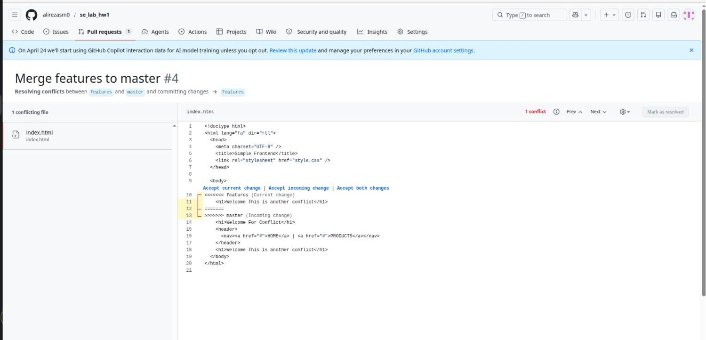
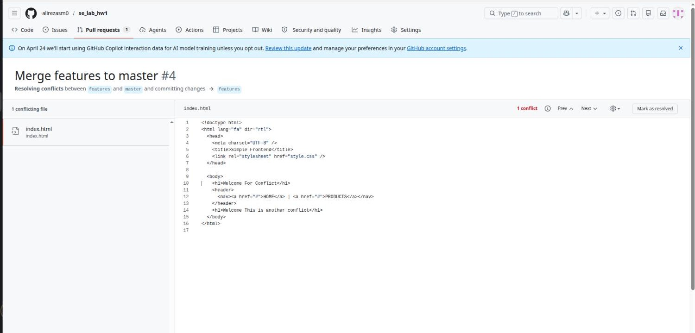

# مقدمه

این پروژه به‌عنوان یکی از تمرین‌های آزمایشگاه درس Software Engineering / Software Development انجام شد. هدف اصلی از انجام آن، فقط طراحی یک صفحه‌ی ساده‌ی Frontend نبود، بلکه آشنایی عملی با مفاهیمی مثل version control، کار تیمی، branch management، حل conflict و همچنین پیاده‌سازی فرایند CI/CD در یک پروژه‌ی واقعی بود.

در این پروژه، یک landing page ایستا با استفاده از HTML5 و CSS3 طراحی شد. علاوه بر توسعه‌ی ظاهر پروژه، تلاش کردیم روند کار را تا حد ممکن شبیه به یک محیط واقعی توسعه‌ی نرم‌افزار پیش ببریم؛ به همین دلیل از یک branching strategy مشخص استفاده کردیم و در نهایت deployment پروژه را با کمک GitHub Actions روی GitHub Pages به‌صورت خودکار انجام دادیم.

# اعضای تیم

این پروژه توسط دو نفر انجام شد،
**امیرحسین روان نخجوانی**  و **علیرضا سلیمیان**.

# شرح کلی پروژه

خروجی پروژه، یک Static Frontend ساده در قالب یک landing page بود. ساختار کلی صفحه با HTML5 نوشته شد و styling آن با CSS3 انجام گرفت. با اینکه خود پروژه از نظر فنی پیچیدگی زیادی نداشت، اما تمرکز اصلی ما روی رعایت اصول حرفه‌ای کار با Git و شبیه‌سازی یک workflow تیمی استاندارد بود.

به همین دلیل، تغییرات پروژه به‌صورت مرحله‌ای و با commitهای کوچک و مشخص ثبت شدند. در مجموع بیش از 20 atomic commit در تاریخچه‌ی پروژه وجود دارد که هر کدام یک تغییر منطقی و مستقل را ثبت می‌کنند. این کار باعث شد روند توسعه شفاف‌تر باشد و بررسی تغییرات یا بازگشت به نسخه‌های قبلی با دقت بیشتری انجام شود.

# Workflow و Branching Strategy

برای مدیریت توسعه‌ی پروژه، از یک ساختار چندشاخه‌ای استفاده کردیم.  
شاخه‌ی `main` به‌عنوان شاخه‌ی نهایی و stable project در نظر گرفته شد و قرار بود فقط نسخه‌های آماده و قابل انتشار وارد آن شوند.  
شاخه‌ی `dev` برای ادغام تغییرات توسعه‌ای و تست نهایی مورد استفاده قرار گرفت.  
همچنین برای توسعه‌ی هر بخش از پروژه، branchهای جداگانه‌ای با الگوی `feature/*` ایجاد شدند؛ برای مثال، بخش‌هایی مثل Header و Footer در branchهای مستقل توسعه داده شدند.  
همچنین از `docs` برای مستندات استفاده شد.

این روش باعث شد تغییرات هر نفر به‌صورت جداگانه مدیریت شود و در زمان merge کردن نیز روند بررسی کدها منظم‌تر باشد. استفاده از این branching model کمک کرد که ساختار کار از حالت فردی و ساده خارج شود و به چیزی نزدیک‌تر به فرایندهای حرفه‌ای تیمی برسد.

# گزارش Conflictها و نحوه‌ی حل آن‌ها

در طول انجام پروژه، برای تمرین عملی merge conflict، دو conflict اصلی به‌صورت کنترل‌شده ایجاد و سپس به‌صورت دستی resolve شدند.

## Conflict اول: تغییر هم‌زمان در `style.css`

اولین conflict در فایل `style.css` اتفاق افتاد. هر دو عضو تیم، به‌صورت هم‌زمان مقدار `background-color` را تغییر داده بودند. زمانی که branchها merge شدند، Git نتوانست به‌صورت خودکار تصمیم بگیرد کدام تغییر باید حفظ شود، بنابراین conflict ایجاد شد.

بعد از بررسی تغییرات، فایل به‌صورت دستی ویرایش شد و در نهایت یک رنگ خنثی و قابل قبول انتخاب شد تا هم از نظر ظاهری مناسب باشد و هم نتیجه‌ی نهایی مورد توافق هر دو نفر قرار بگیرد.

## Conflict دوم: تغییر در `index.html`

دومین conflict در فایل `index.html` و در بخش heading اصلی صفحه، یعنی تگ `<h1>`، به وجود آمد. این conflict زمانی رخ داد که branch مربوط به `feature/footer` در `dev` merge شد، چون هر دو نفر متن عنوان اصلی پروژه را تغییر داده بودند.

برای حل این مشکل، محتوای هر دو نسخه بررسی شد و در نهایت یک عنوان نهایی انتخاب شد که ایده‌ی هر دو تغییر را تا حد ممکن پوشش بدهد. بعد از آن، فایل بدون مشکل merge و commit شد.

تصاویر این بخش نیز به‌ترتیب، وضعیت conflict در فایل HTML و نسخه‌ی نهایی پس از حل شدن آن را نمایش می‌دهند.

# پیاده‌سازی CI/CD

یکی از بخش‌های مهم این پروژه، راه‌اندازی فرایند CI/CD بود. برای این کار، یک GitHub Actions workflow در مسیر `.github/workflows/deploy.yml` تعریف شد. این workflow به‌گونه‌ای تنظیم شد که با هر بار `push` روی branch `main`، فرایند build و deployment پروژه به‌صورت خودکار انجام شود.

در نتیجه، آخرین نسخه‌ی stable پروژه بدون نیاز به deploy دستی روی **GitHub Pages** منتشر می‌شود. این بخش از پروژه باعث شد با مفهوم continuous deployment در مقیاس کوچک و در بستر GitHub به‌صورت عملی آشنا شویم.

آدرس نهایی پروژه در این قسمت قرار می‌گیرد:

**GitHub Pages URL:** https://alirezasm0.github.io/se_lab_hw1/

# پاسخ به پرسش‌های فنی

## پوشه‌ی `.git`

پوشه‌ی `.git` یک پوشه‌ی مخفی در ریشه‌ی repository است که در واقع هسته‌ی اصلی Git را تشکیل می‌دهد. تمام اطلاعات مهم repository از جمله objectها، commitها، referenceها، branchها، tagها، فایل‌های config و همچنین staging area در این بخش نگهداری می‌شوند. این پوشه معمولاً با اجرای دستور `git init` ساخته می‌شود و بدون آن، پروژه عملاً یک Git repository محسوب نمی‌شود.

## Atomic Commit و Atomic Pull Request

منظور از **atomic commit** این است که هر commit فقط شامل یک تغییر منطقی و مشخص باشد. برای مثال، اگر قرار است فقط Footer اضافه شود، بهتر است همان تغییر در یک commit جدا ثبت شود و با تغییرات دیگر ترکیب نشود. این کار باعث می‌شود history پروژه تمیزتر و قابل‌فهم‌تر باشد.

به همین صورت، **atomic Pull Request** هم باید روی یک feature یا یک fix مشخص متمرکز باشد. وقتی یک Pull Request بیش از حد شلوغ یا شامل چند تغییر نامرتبط باشد، review کردن آن سخت‌تر می‌شود. اما اگر تغییرات محدود و متمرکز باشند، هم بررسی آن راحت‌تر است و هم احتمال خطا کمتر می‌شود.

## مقایسه‌ی برخی دستورات مهم Git

تفاوت `fetch` و `pull` در این است که `fetch` فقط اطلاعات جدید را از remote repository دریافت می‌کند، اما آن‌ها را وارد branch فعلی نمی‌کند. در مقابل، `pull` علاوه بر دریافت تغییرات، آن‌ها را با branch جاری merge می‌کند.

در مورد `merge` و `rebase`، هر دو برای ترکیب history استفاده می‌شوند اما رفتار آن‌ها متفاوت است. `merge` یک commit جدید برای اتصال دو شاخه ایجاد می‌کند و history را به همان شکل واقعی حفظ می‌کند. در مقابل، `rebase` تغییرات یک branch را روی نوک branch مقصد قرار می‌دهد تا history پروژه خطی‌تر و مرتب‌تر دیده شود.

دستور `cherry-pick` زمانی کاربرد دارد که بخواهیم فقط یک commit خاص را از یک branch به branch دیگری منتقل کنیم، بدون اینکه کل branch را merge کنیم.

## دستورات مربوط به Undo و جابه‌جایی

دستور `reset` برای جابه‌جا کردن branch pointer به commitهای قبلی استفاده می‌شود و بسته به نوع استفاده، ممکن است تغییرات local را هم حذف کند. به همین دلیل باید با دقت استفاده شود.

دستور `revert` برعکس، history را پاک نمی‌کند بلکه یک commit جدید ایجاد می‌کند که اثر یک commit قبلی را خنثی می‌کند. به همین دلیل برای shared branchها گزینه‌ی امن‌تری محسوب می‌شود.

دستور `restore` بیشتر برای برگرداندن تغییرات فایل‌ها یا خارج کردن آن‌ها از staging area به کار می‌رود.

همچنین `switch` برای تغییر branch استفاده می‌شود، در حالی که `checkout` یک دستور قدیمی‌تر و چندمنظوره است که هم برای جابه‌جایی بین branchها و هم برای بازیابی فایل‌ها استفاده می‌شد.

## Staging و Stashing

بخش **staging area** یا **index** مرحله‌ای بین تغییر فایل‌ها و commit شدن آن‌هاست. در این بخش مشخص می‌کنیم که دقیقاً کدام تغییرات قرار است وارد commit بعدی شوند.

در مقابل، `stash` یک فضای موقت برای نگهداری تغییرات ناتمام است. وقتی کاربر بخواهد بدون commit کردن، branch خود را عوض کند یا موقتاً روی موضوع دیگری کار کند، می‌تواند تغییرات فعلی را stash کند و بعداً دوباره آن‌ها را برگرداند.

## Snapshot در Git

برخلاف تصور رایج، Git فقط diff بین فایل‌ها را ذخیره نمی‌کند، بلکه وضعیت کل پروژه را در هر لحظه به‌صورت یک **snapshot** در نظر می‌گیرد. هر **commit** در واقع به یک snapshot از فایل‌های پروژه اشاره می‌کند. این مدل باعث می‌شود مدیریت نسخه‌ها در Git سریع، دقیق و قابل اعتماد باشد.

## تفاوت Local Repository و Remote Repository

**Local repository** همان نسخه‌ای از پروژه است که روی سیستم شخصی توسعه‌دهنده قرار دارد و تغییرات ابتدا در آن اعمال می‌شوند.  
**Remote repository** نسخه‌ای از پروژه است که روی یک سرور مانند **GitHub** میزبانی می‌شود تا اعضای تیم بتوانند به آن دسترسی داشته باشند، تغییرات را با یکدیگر به اشتراک بگذارند و همکاری هماهنگ‌تری داشته باشند.
